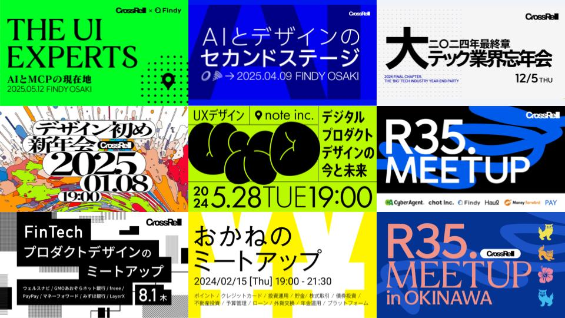

# 速度と品質を意識したAI開発

## dotFes 2025 Yokohama / Lumilinks こぎそ

---

# 今日のゴールと持ち帰り

- 基本的なツールの説明、各機能の便利機能などを知れる
- AI周りのツールや周辺サービスを覚えれる
- ウェブサイトやコンポーネントをAIを使って実装し、品質を意識した作り方を学ぶことができる。
- AIの限界を知ることができる。

---

# 講師紹介

---

<small>**株式会社Lumilinks 代表取締役 / デジタルプロダクトデザイナー**</small>

## こぎそ（@kgsi）

<small>受託制作会社でデザイナー・エンジニアとして勤務後、2020年に株式会社SmartHRに入社、プロダクトデザイナーとして従事、その後生成AIベンチャーで勤務後、2025年からスタートアップの1人目デザイナーとして従事。</small>
<small>2025年に個人会社として株式会社Lumilinks（ルミリンクス）を設立。著書に『ちいさくはじめるデザインシステム（BNN）』など。コミュニティ運営やアドバイザーとしても活動、テック業界向けコミュニティ「CrossRel」を運営中。</small>

---

---

---

# アジェンダ（90分）

- **イントロダクション (5分)**
- **AIエージェントの基礎 (5分)**
- **実践テクニック (70分)**
  - [セットアップ](/hands-on/01-setup.md)
  - [ウェブサイトコーディング](/hands-on//02-website-coding.md)
  - [UIコンポーネントコーディング](/hands-on//03-ui-components.md)
- **まとめ・Q&A (10分)**

---

# そもそもAIエージェントとは

- 自律的に目標を理解し、状況に応じて行動を計画・実行するAIのこと。
- 大規模言語モデルをベースに、ツール・API・データベースを“手足”として使う。
- データインプット、思考、アクション、フィードバックのループでタスクを継続的に前進させる。
  - 例：情報収集→要約→メール送信、チケット起票、外部システム連携による業務自動化。
- 人が定める目的・制約・監督のもとで、反復的／定型的な仕事の効率と品質を向上させる。

---

# アーキテクチャの視点

- AIエージェントは、複雑なタスクを簡素化および自動化することで機能する
- ほとんどの自律型エージェントは、割り当てられたタスクを実行する際に特定のワークフローに従う

---

## 1.目標を決定する

- ユーザーから特定の指示または目標を受け取る
- 最終結果を関連性が高く有用なものにするためのタスクを計画する
- 目標を小さな実行可能なタスクに分割
- 特定の順序または条件に基づいてタスクを実行

---

## 2.情報を取得する

- 計画したタスクを実行するための情報を収集する
- インターネットにアクセスして必要な情報を検索・取得
- 他のエージェントや機械学習モデルと対話
- 顧客の感情分析など、タスクに応じた適切なデータを抽出

---

## 3.タスクを実装する

- 十分なデータを基にタスクを系統立てて実行
- 完了したタスクをリストから削除して次のタスクに進む
- 外部からのフィードバックを求めて進捗を評価
- 必要に応じて追加タスクを作成・処理

---

---

## 教材ファイル

https://github.com/kgsi/ai-coding-workshop-202508

---
